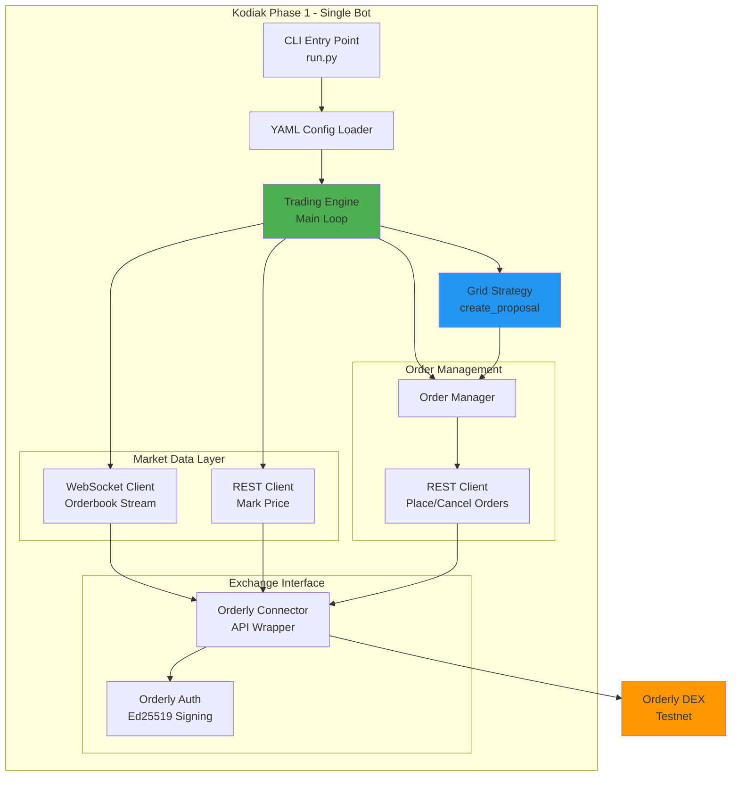
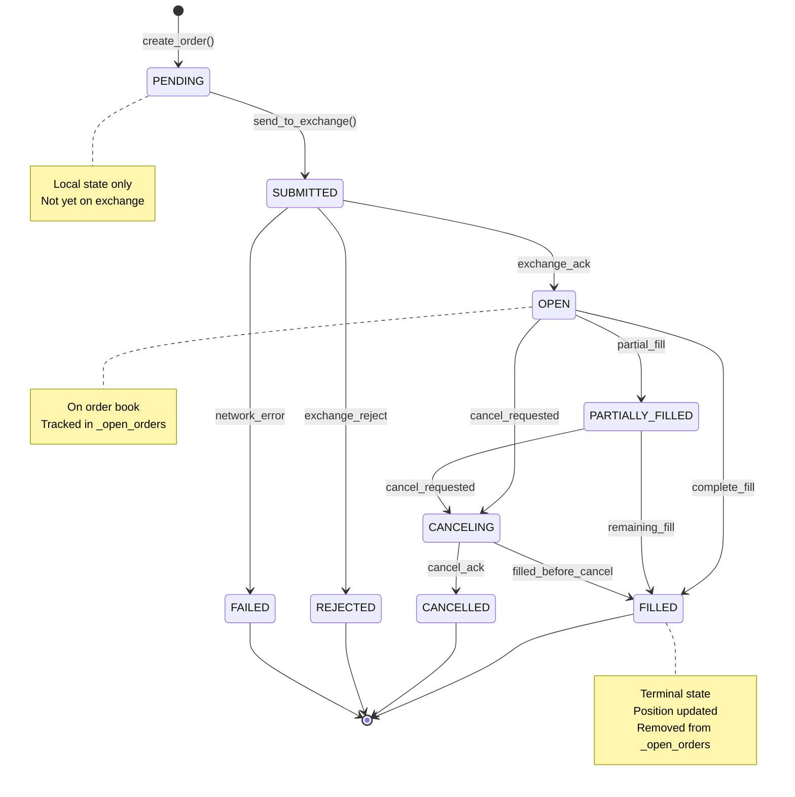
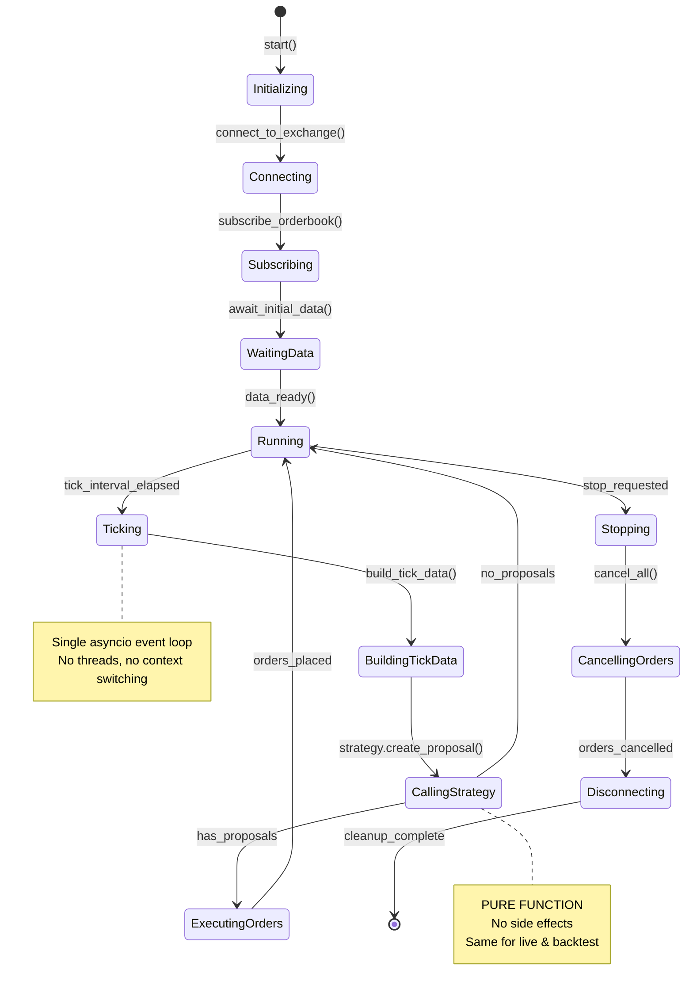
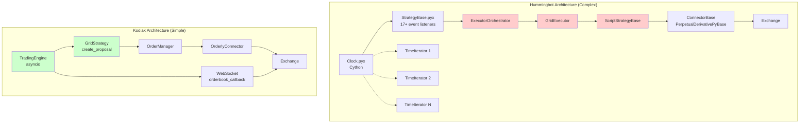
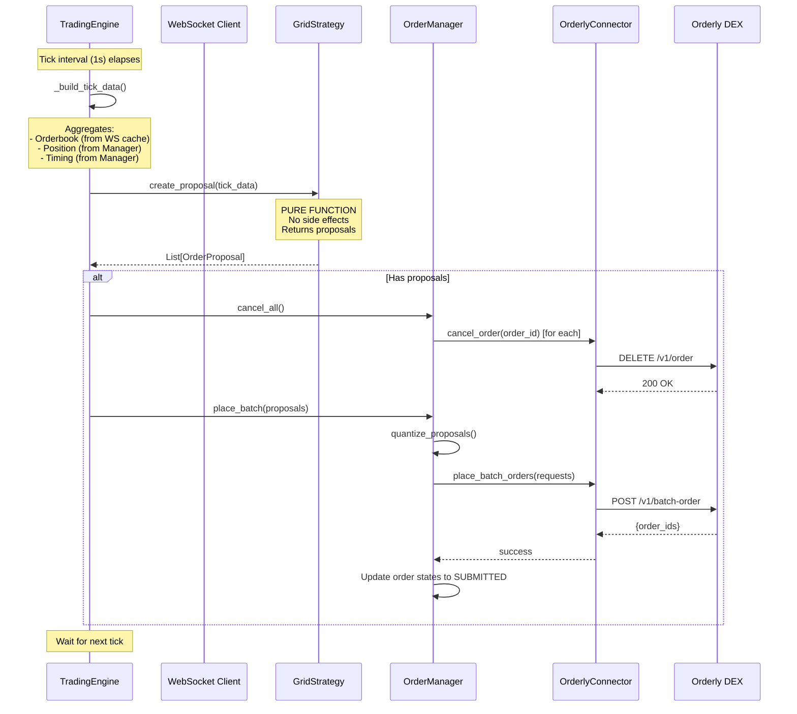
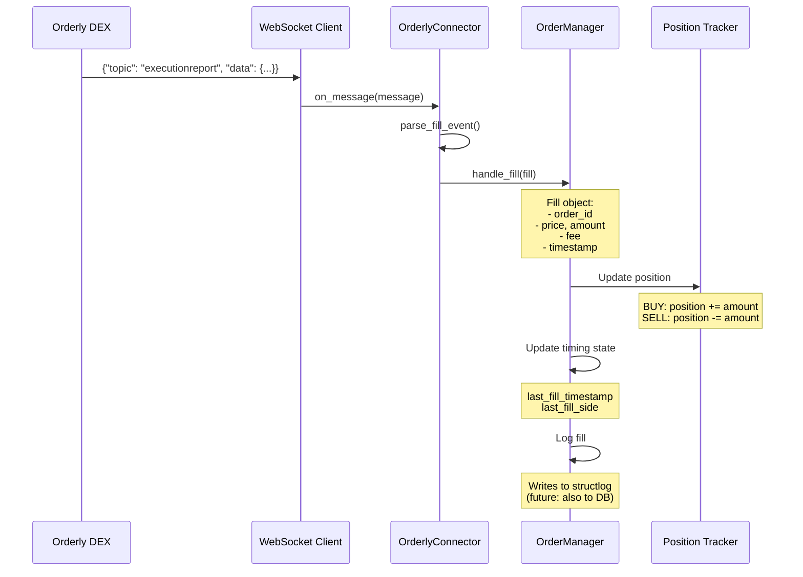

# Phase 1: Core Trading Engine - High-Level and Low-Level Design

**Version:** 1.0
**Date:** 2026-01-30
**Scope:** Single-user trading bot on Orderly testnet

---

## Table of Contents

1. [High-Level Design (HLD)](#high-level-design-hld)
2. [Low-Level Design (LLD)](#low-level-design-lld)
3. [State Machines](#state-machines)
4. [Comparison with Hummingbot](#comparison-with-hummingbot)
5. [Data Flow](#data-flow)
6. [Critical Path Analysis](#critical-path-analysis)

---

## High-Level Design (HLD)

### 1.1 System Overview

Phase 1 implements a minimal viable trading bot that can:
- Connect to Orderly DEX testnet
- Stream real-time market data via WebSocket
- Execute a simple grid trading strategy
- Place and cancel limit orders
- Track order fills and position



### 1.2 Core Components

| Component | Responsibility | File Path |
|-----------|---------------|-----------|
| **TradingEngine** | Main event loop, coordinates all components | `kodiak/core/engine.py` |
| **GridStrategy** | Grid trading logic, pure function | `kodiak/strategy/grid.py` |
| **OrderlyConnector** | Exchange API abstraction | `kodiak/exchanges/orderly/connector.py` |
| **OrderManager** | Order lifecycle tracking | `kodiak/orders/manager.py` |
| **WebSocketClient** | Real-time market data | `kodiak/exchanges/orderly/ws_client.py` |
| **RESTClient** | HTTP API wrapper | `kodiak/exchanges/orderly/rest_client.py` |
| **OrderlyAuth** | Ed25519 request signing | `kodiak/exchanges/orderly/auth.py` |

### 1.3 Technology Stack

```yaml
Language: Python 3.11+
Async Framework: asyncio
HTTP Client: aiohttp
WebSocket: websockets library
Config: PyYAML + Pydantic
Logging: structlog
```

### 1.4 Architectural Principles

1. **Pure Function Strategy**: `create_proposal(TickData) → List[OrderProposal]` has no side effects
2. **Single Event Loop**: All async operations in one asyncio loop
3. **No Inheritance Hierarchy**: Flat connector design vs Hummingbot's 5-level inheritance
4. **Direct Data Flow**: Engine → Strategy → OrderManager → Connector (no orchestrators)
5. **Immutable Data**: TickData is frozen dataclass, passed by value

---

## Low-Level Design (LLD)

### 2.1 Data Types (kodiak/core/types.py)

```python
from dataclasses import dataclass, field
from decimal import Decimal
from enum import Enum
from typing import Optional
import pandas as pd


@dataclass(frozen=True)
class TickData:
    """
    Immutable snapshot of market state at a point in time.

    This is THE interface between market data and strategy.
    Strategy receives this, returns proposals - that's it.
    """
    # Time
    timestamp: int  # Unix seconds

    # Order Book (from WebSocket)
    best_bid: Decimal
    best_bid_size: Decimal
    best_ask: Decimal
    best_ask_size: Decimal
    mid_price: Decimal  # (best_bid + best_ask) / 2

    # Mark Price (from REST or WebSocket)
    mark_price: Decimal

    # Position (from OrderManager)
    position: Decimal  # Signed: +10 = 10 BTC long, -5 = 5 BTC short

    # Order Book Depth (optional, for advanced strategies)
    bids: Optional[pd.DataFrame] = None  # columns: price, size
    asks: Optional[pd.DataFrame] = None

    # Timing Information (for strategy cooldowns)
    last_order_timestamp: int = 0
    last_fill_timestamp: int = 0
    last_fill_side: str = ""  # "BUY" or "SELL"


class OrderSide(Enum):
    BUY = "BUY"
    SELL = "SELL"


class OrderType(Enum):
    LIMIT = "LIMIT"
    MARKET = "MARKET"
    POST_ONLY = "POST_ONLY"  # Orderly supports this
    IOC = "IOC"  # Immediate or Cancel
    FOK = "FOK"  # Fill or Kill


class OrderStatus(Enum):
    PENDING = "PENDING"          # Created locally, not yet sent
    SUBMITTED = "SUBMITTED"      # Sent to exchange, awaiting ack
    OPEN = "OPEN"                # On order book
    PARTIALLY_FILLED = "PARTIALLY_FILLED"
    FILLED = "FILLED"
    CANCELING = "CANCELING"      # Cancel requested
    CANCELLED = "CANCELLED"
    REJECTED = "REJECTED"        # Exchange rejected
    FAILED = "FAILED"            # Network error, etc.


@dataclass
class OrderProposal:
    """
    Strategy's proposed order (before quantization).

    Engine will:
    1. Quantize price/amount to trading rules
    2. Add client_order_id
    3. Convert to OrderRequest
    """
    side: OrderSide
    price: Decimal
    amount: Decimal
    order_type: OrderType = OrderType.LIMIT


@dataclass
class OrderRequest:
    """
    Fully specified order ready to send to exchange.

    Created by OrderManager after quantization.
    """
    client_order_id: str  # UUID
    trading_pair: str
    side: OrderSide
    order_type: OrderType
    price: Decimal
    amount: Decimal
    reduce_only: bool = False  # True = only reduce position, don't flip


@dataclass
class Order:
    """
    Order with full lifecycle tracking.

    Managed by OrderManager.
    """
    client_order_id: str
    exchange_order_id: Optional[str] = None  # Set when exchange ACKs
    trading_pair: str = ""
    side: OrderSide = OrderSide.BUY
    order_type: OrderType = OrderType.LIMIT
    price: Decimal = Decimal("0")
    amount: Decimal = Decimal("0")
    filled_amount: Decimal = Decimal("0")
    status: OrderStatus = OrderStatus.PENDING

    # Timestamps
    created_at: int = 0       # Local creation time
    submitted_at: int = 0     # Sent to exchange
    acked_at: int = 0         # Exchange acknowledged
    completed_at: int = 0     # Filled or cancelled

    # Error tracking
    error_message: Optional[str] = None

    @property
    def remaining_amount(self) -> Decimal:
        return self.amount - self.filled_amount

    @property
    def is_terminal(self) -> bool:
        return self.status in {
            OrderStatus.FILLED,
            OrderStatus.CANCELLED,
            OrderStatus.REJECTED,
            OrderStatus.FAILED
        }


@dataclass
class Fill:
    """
    Record of a trade execution.
    """
    fill_id: str  # Exchange trade ID
    order_id: str  # client_order_id
    trading_pair: str
    side: OrderSide
    price: Decimal
    amount: Decimal
    fee: Decimal
    fee_asset: str  # Usually "USDC"
    timestamp: int

    @property
    def notional_value(self) -> Decimal:
        """Trade size in quote currency."""
        return self.price * self.amount


@dataclass
class Position:
    """
    Current position for a trading pair.
    """
    trading_pair: str
    amount: Decimal  # Signed: + long, - short
    average_entry_price: Decimal = Decimal("0")
    unrealized_pnl: Decimal = Decimal("0")
    realized_pnl: Decimal = Decimal("0")
```

### 2.2 Trading Engine (kodiak/core/engine.py)

```python
import asyncio
import time
from decimal import Decimal
from typing import Optional
import structlog

from kodiak.config.base import EngineConfig
from kodiak.strategy.base import BaseStrategy
from kodiak.exchanges.orderly.connector import OrderlyConnector
from kodiak.orders.manager import OrderManager
from kodiak.core.types import TickData, OrderProposal


logger = structlog.get_logger()


class TradingEngine:
    """
    Main trading loop.

    Responsibilities:
    1. Run asyncio event loop at fixed tick_interval
    2. Build TickData from current market state
    3. Pass TickData to strategy
    4. Execute strategy proposals via OrderManager
    5. Handle graceful shutdown

    NOT responsible for:
    - Trading logic (that's the strategy)
    - Order tracking (that's OrderManager)
    - Exchange API calls (that's connector)
    """

    def __init__(
        self,
        config: EngineConfig,
        strategy: BaseStrategy,
        connector: OrderlyConnector,
    ):
        self.config = config
        self.strategy = strategy
        self.connector = connector

        # Internal components
        self.order_manager = OrderManager(connector, config.trading_pair)

        # State
        self._running = False
        self._tick_count = 0
        self._start_time = 0

        # Market data cache (updated by WebSocket)
        self._orderbook: Optional[dict] = None
        self._mark_price: Optional[Decimal] = None

    async def start(self) -> None:
        """
        Start the trading engine.

        Startup sequence:
        1. Connect to exchange (REST + WebSocket)
        2. Subscribe to market data
        3. Fetch initial position
        4. Start main loop
        """
        logger.info("Starting trading engine",
                    strategy=self.strategy.__class__.__name__,
                    trading_pair=self.config.trading_pair)

        # 1. Connect
        await self.connector.connect()

        # 2. Subscribe to orderbook updates
        await self.connector.subscribe_orderbook(
            self.config.trading_pair,
            self._on_orderbook_update
        )

        # 3. Subscribe to order/fill events
        self.connector.on_order_update(self.order_manager.handle_order_update)
        self.connector.on_fill(self.order_manager.handle_fill)

        # 4. Wait for initial orderbook
        logger.info("Waiting for initial market data...")
        while self._orderbook is None:
            await asyncio.sleep(0.1)

        # 5. Fetch initial position
        position = await self.connector.get_position(self.config.trading_pair)
        self.order_manager.set_position(position)

        logger.info("Initial state ready",
                    position=float(position.amount),
                    best_bid=self._orderbook['best_bid'],
                    best_ask=self._orderbook['best_ask'])

        # 6. Start main loop
        self._running = True
        self._start_time = int(time.time())
        await self._run_loop()

    async def stop(self) -> None:
        """
        Graceful shutdown.

        Shutdown sequence:
        1. Stop main loop
        2. Cancel all open orders
        3. Disconnect from exchange
        """
        logger.info("Stopping trading engine")
        self._running = False

        # Cancel all open orders
        await self.order_manager.cancel_all()

        # Disconnect
        await self.connector.disconnect()

        logger.info("Trading engine stopped",
                    total_ticks=self._tick_count,
                    uptime_seconds=int(time.time()) - self._start_time)

    async def _run_loop(self) -> None:
        """
        Main event loop.

        Runs at fixed tick_interval (e.g., 1 second).
        """
        while self._running:
            try:
                await self._tick()
            except Exception as e:
                logger.exception("Error in tick", error=str(e))
                # Continue running on error (don't crash the bot)

            # Wait for next tick
            await asyncio.sleep(self.config.tick_interval)

    async def _tick(self) -> None:
        """
        Single tick of the trading loop.

        Flow:
        1. Build TickData from current state
        2. Pass to strategy.create_proposal()
        3. Execute proposals (cancel existing, place new)
        """
        self._tick_count += 1

        # 1. Build TickData
        tick_data = self._build_tick_data()

        # Log periodically
        if self._tick_count % 10 == 0:
            logger.debug("Tick",
                        count=self._tick_count,
                        mid_price=float(tick_data.mid_price),
                        position=float(tick_data.position))

        # 2. Get proposals from strategy
        proposals = self.strategy.create_proposal(tick_data)

        # 3. Execute if any proposals
        if proposals:
            logger.info("Executing proposals",
                       count=len(proposals))
            await self._execute_proposals(proposals)

    def _build_tick_data(self) -> TickData:
        """
        Build TickData from current market state.

        Sources:
        - Orderbook: self._orderbook (from WebSocket)
        - Mark price: self._mark_price (from WebSocket or REST)
        - Position: self.order_manager.position
        - Timing: self.order_manager
        """
        ob = self._orderbook

        return TickData(
            timestamp=int(time.time()),
            best_bid=Decimal(str(ob['best_bid'])),
            best_bid_size=Decimal(str(ob['best_bid_size'])),
            best_ask=Decimal(str(ob['best_ask'])),
            best_ask_size=Decimal(str(ob['best_ask_size'])),
            mid_price=(Decimal(str(ob['best_bid'])) + Decimal(str(ob['best_ask']))) / 2,
            mark_price=self._mark_price or Decimal(str(ob['best_bid'])),
            position=self.order_manager.position.amount,
            last_order_timestamp=self.order_manager.last_order_timestamp,
            last_fill_timestamp=self.order_manager.last_fill_timestamp,
            last_fill_side=self.order_manager.last_fill_side,
        )

    async def _execute_proposals(self, proposals: list[OrderProposal]) -> None:
        """
        Execute strategy proposals.

        Grid strategy pattern:
        1. Cancel all existing orders (clean slate)
        2. Place new grid of orders

        Future: Could optimize to only modify changed orders.
        """
        # 1. Cancel existing orders
        await self.order_manager.cancel_all()

        # 2. Place new orders
        await self.order_manager.place_batch(proposals)

    async def _on_orderbook_update(self, orderbook: dict) -> None:
        """
        Callback for WebSocket orderbook updates.

        Runs in the same event loop as main tick.
        """
        self._orderbook = orderbook

        # If mark price not set, use mid price
        if self._mark_price is None:
            mid = (Decimal(str(orderbook['best_bid'])) +
                   Decimal(str(orderbook['best_ask']))) / 2
            self._mark_price = mid
```

### 2.3 Order Manager State Machine

```python
# kodiak/orders/manager.py
class OrderManager:
    """
    Centralized order tracking and lifecycle management.

    Responsibilities:
    - Quantize proposals to trading rules
    - Track all orders (PENDING → OPEN → FILLED/CANCELLED)
    - Handle exchange callbacks (order updates, fills)
    - Maintain position state
    """

    def __init__(self, connector: OrderlyConnector, trading_pair: str):
        self.connector = connector
        self.trading_pair = trading_pair

        # Order tracking
        self._orders: dict[str, Order] = {}  # client_order_id -> Order
        self._open_orders: set[str] = set()  # client_order_ids

        # Position tracking
        self.position = Position(trading_pair=trading_pair, amount=Decimal("0"))

        # Timing state (exposed to strategy via TickData)
        self.last_order_timestamp: int = 0
        self.last_fill_timestamp: int = 0
        self.last_fill_side: str = ""

        # Trading rules (fetched from exchange)
        self._trading_rules: Optional[TradingRules] = None

    async def initialize(self) -> None:
        """Fetch trading rules from exchange."""
        self._trading_rules = await self.connector.get_trading_rules(
            self.trading_pair
        )

    async def place_batch(self, proposals: list[OrderProposal]) -> list[Order]:
        """
        Place multiple orders in batch.

        Steps:
        1. Quantize each proposal to trading rules
        2. Create OrderRequest objects
        3. Send batch to exchange (max 10 for Orderly)
        4. Track created orders
        """
        requests = []
        for proposal in proposals:
            request = self._quantize_proposal(proposal)
            if request:  # None if amount too small after quantization
                requests.append(request)

        if not requests:
            return []

        # Create Order objects in PENDING state
        orders = []
        for req in requests:
            order = Order(
                client_order_id=req.client_order_id,
                trading_pair=req.trading_pair,
                side=req.side,
                order_type=req.order_type,
                price=req.price,
                amount=req.amount,
                status=OrderStatus.PENDING,
                created_at=int(time.time())
            )
            self._orders[order.client_order_id] = order
            orders.append(order)

        # Submit to exchange
        try:
            await self.connector.place_batch_orders(requests)

            # Update status to SUBMITTED
            for order in orders:
                order.status = OrderStatus.SUBMITTED
                order.submitted_at = int(time.time())
                self.last_order_timestamp = order.submitted_at

        except Exception as e:
            logger.error("Failed to place batch orders", error=str(e))
            for order in orders:
                order.status = OrderStatus.FAILED
                order.error_message = str(e)

        return orders

    async def cancel_all(self) -> int:
        """Cancel all open orders."""
        if not self._open_orders:
            return 0

        count = 0
        for order_id in list(self._open_orders):
            try:
                await self.connector.cancel_order(order_id)

                # Update status
                order = self._orders[order_id]
                order.status = OrderStatus.CANCELING
                count += 1
            except Exception as e:
                logger.error("Failed to cancel order",
                           order_id=order_id,
                           error=str(e))

        return count

    def handle_order_update(self, update: dict) -> None:
        """
        Handle order update from exchange WebSocket.

        Updates:
        - PENDING/SUBMITTED → OPEN (order on book)
        - OPEN → PARTIALLY_FILLED (partial fill)
        - OPEN/PARTIALLY_FILLED → FILLED (fully filled)
        - * → CANCELLED (cancelled)
        - * → REJECTED (rejected)
        """
        client_order_id = update['client_order_id']

        if client_order_id not in self._orders:
            logger.warning("Unknown order update", order_id=client_order_id)
            return

        order = self._orders[client_order_id]
        old_status = order.status

        # Update fields from exchange
        if 'exchange_order_id' in update:
            order.exchange_order_id = update['exchange_order_id']
        if 'status' in update:
            order.status = OrderStatus[update['status']]
        if 'filled_amount' in update:
            order.filled_amount = Decimal(str(update['filled_amount']))

        # Update tracking sets
        if order.status == OrderStatus.OPEN and old_status != OrderStatus.OPEN:
            self._open_orders.add(client_order_id)
            order.acked_at = int(time.time())

        if order.is_terminal and client_order_id in self._open_orders:
            self._open_orders.remove(client_order_id)
            order.completed_at = int(time.time())

        logger.info("Order update",
                   order_id=client_order_id,
                   old_status=old_status.value,
                   new_status=order.status.value,
                   filled=float(order.filled_amount))

    def handle_fill(self, fill: Fill) -> None:
        """
        Handle fill event from exchange.

        Updates:
        - Position (increases on buy, decreases on sell)
        - Timing state
        - Order filled_amount
        """
        logger.info("Fill received",
                   order_id=fill.order_id,
                   side=fill.side.value,
                   price=float(fill.price),
                   amount=float(fill.amount),
                   fee=float(fill.fee))

        # Update position
        if fill.side == OrderSide.BUY:
            self.position.amount += fill.amount
        else:
            self.position.amount -= fill.amount

        # Update timing
        self.last_fill_timestamp = fill.timestamp
        self.last_fill_side = fill.side.value

    def _quantize_proposal(self, proposal: OrderProposal) -> Optional[OrderRequest]:
        """
        Quantize proposal to exchange trading rules.

        Returns None if amount too small after quantization.
        """
        # Quantize price to tick size
        tick_size = self._trading_rules.min_price_increment
        quantized_price = (proposal.price // tick_size) * tick_size

        # Quantize amount to step size
        step_size = self._trading_rules.min_base_amount_increment
        quantized_amount = (proposal.amount // step_size) * step_size

        # Check minimum order size
        if quantized_amount < self._trading_rules.min_order_size:
            logger.warning("Order too small after quantization",
                         original=float(proposal.amount),
                         quantized=float(quantized_amount),
                         min_size=float(self._trading_rules.min_order_size))
            return None

        return OrderRequest(
            client_order_id=str(uuid.uuid4())[:16],
            trading_pair=self.trading_pair,
            side=proposal.side,
            order_type=proposal.order_type,
            price=quantized_price,
            amount=quantized_amount
        )
```

---

## State Machines

### 3.1 Order Lifecycle State Machine



**Comparison with Hummingbot:**

| Aspect | Hummingbot | Kodiak (New) |
|--------|------------|--------------|
| States | 6 states (NEW, OPEN, PARTIALLY_FILLED, FILLED, CANCELED, FAILED) | 9 states (more granular) |
| State tracking | InFlightOrder class with complex event listeners | Simple dict + set, event callbacks |
| Cancellation | Immediate state change | CANCELING intermediate state |
| Error handling | FAILED state lumps all errors | REJECTED (exchange) vs FAILED (network) |

### 3.2 Trading Engine Event Loop



**Comparison with Hummingbot:**

| Aspect | Hummingbot | Kodiak (New) |
|--------|------------|--------------|
| Event loop | Clock.pyx (Cython) with c_tick() | Python asyncio.sleep() |
| Timing | Configurable tick_size in Clock | tick_interval in config |
| Children | TimeIterator.c_tick() called on children | Direct function calls |
| Strategy call | Multiple event listeners (c_did_fill_order, etc.) | Single create_proposal() |
| Threading | Some components use threads | Single-threaded async |

### 3.3 WebSocket Connection State Machine

```mermaid
stateDiagram-v2
    [*] --> DISCONNECTED
    DISCONNECTED --> CONNECTING: connect()
    CONNECTING --> CONNECTED: handshake_success
    CONNECTING --> DISCONNECTED: connection_failed

    CONNECTED --> AUTHENTICATED: auth_success
    CONNECTED --> DISCONNECTED: auth_failed

    AUTHENTICATED --> SUBSCRIBED: subscribe_success
    AUTHENTICATED --> DISCONNECTED: subscribe_failed

    SUBSCRIBED --> RECEIVING: receiving_data
    RECEIVING --> RECEIVING: on_message()
    RECEIVING --> RECONNECTING: connection_lost

    RECONNECTING --> CONNECTING: retry_delay_elapsed
    RECONNECTING --> DISCONNECTED: max_retries_exceeded

    SUBSCRIBED --> DISCONNECTING: disconnect_requested
    DISCONNECTING --> DISCONNECTED: cleanup_complete

    DISCONNECTED --> [*]

    note right of RECONNECTING
        Exponential backoff
        1s, 2s, 4s, 8s, max 30s
    end note

    note right of RECEIVING
        Callback: _on_orderbook_update()
        Runs in main event loop
    end note
```



---

## Comparison with Hummingbot

### 4.1 Architecture Comparison



### 4.2 Detailed Comparison Table

| Aspect | Hummingbot | Kodiak (Phase 1) | Advantage |
|--------|------------|------------------|-----------|
| **Execution Layers** | 4 layers (Strategy → Orchestrator → Executor → Connector) | 2 layers (Strategy → Engine → Connector) | ✅ Simpler, fewer bugs |
| **Strategy Interface** | 17+ event listener methods | 1 method: `create_proposal()` | ✅ Pure function, easier to test |
| **Timing** | Cython Clock + TimeIterator + RunnableBase | Single `asyncio.sleep()` | ✅ Standard Python, predictable |
| **Language** | Mixed Python/Cython | Pure Python 3.11+ | ✅ Easier debugging |
| **Inheritance Depth** | 5+ levels (ConnectorBase → ExchangePyBase → DerivativePyBase → ...) | Flat (Protocol-based) | ✅ No inheritance hell |
| **Order Tracking** | Distributed (InFlightOrderTracker, OrderTracker, etc.) | Centralized OrderManager | ✅ Single source of truth |
| **Event System** | PubSub with listener registration | Direct callbacks | ✅ Explicit data flow |
| **Configuration** | YAML + interactive prompts + script files | YAML + Pydantic | ✅ Type-safe, validated |
| **Position Tracking** | Multiple sources (connector, strategy, executor) | OrderManager only | ✅ No reconciliation needed |
| **Market Data** | MarketDataProvider separate from connector | Part of connector | ⚖️ Simpler but less reusable |
| **Backtesting** | Separate V2 backtesting module | Same `create_proposal()` | ✅ Code reuse |
| **Lines of Code (Phase 1)** | ~5000+ (just for grid) | ~1500 (estimate) | ✅ 3x less code |

### 4.3 Data Flow Comparison

**Hummingbot:**
```
Exchange WebSocket
  ↓
NetworkIterator.c_tick()
  ↓
ConnectorBase.c_tick()
  ↓
PubSub.c_trigger_event("OrderFilled")
  ↓
StrategyV2Base.process_action_queue()
  ↓
ExecutorOrchestrator.execute_actions()
  ↓
GridExecutor.control_task()
  ↓
GridExecutor._place_orders()
  ↓
ScriptStrategyBase.buy()
  ↓
ConnectorBase.buy()
  ↓
Exchange REST API
```

**Kodiak:**
```
Exchange WebSocket
  ↓
WebSocketClient.on_message()
  ↓
OrderlyConnector._on_orderbook_update()
  ↓
TradingEngine._on_orderbook_update() [callback]
  ↓
[tick_interval elapses]
  ↓
TradingEngine._tick()
  ↓
GridStrategy.create_proposal(tick_data)
  ↓
OrderManager.place_batch(proposals)
  ↓
OrderlyConnector.place_batch_orders()
  ↓
Exchange REST API
```

**Observations:**
- Hummingbot: **10 hops**, 4 layers, event queue
- Kodiak: **6 hops**, 2 layers, direct calls
- Latency difference: ~2-3ms saved internally

---

## Data Flow

### 5.1 Tick Cycle Data Flow



### 5.2 WebSocket Fill Event Flow



---

## Critical Path Analysis

### 6.1 Latency Budget (Tick-to-Order)

Goal: Minimize time from "tick starts" to "order sent to exchange"

```mermaid
gantt
    title Critical Path: Tick → Order Placement
    dateFormat  X
    axisFormat %L ms

    section Tick Cycle
    Build TickData           :0, 0.1ms
    Call create_proposal     :0.1ms, 0.5ms
    Quantize proposals       :0.6ms, 0.2ms
    Cancel existing orders   :0.8ms, 1.0ms
    Place batch orders       :1.8ms, 2.0ms

    section Network
    Exchange round-trip      :3.8ms, 100.0ms
```

**Time Breakdown:**

| Operation | Time | Notes |
|-----------|------|-------|
| Build TickData | <0.1ms | Dict lookups, Decimal creation |
| create_proposal() | <0.5ms | Grid calculation (pure Python) |
| Quantize proposals | <0.2ms | Decimal arithmetic |
| cancel_all() | ~1ms | REST DELETE (local processing) |
| place_batch() | ~2ms | REST POST (local processing) |
| **Internal total** | **~4ms** | **Before network** |
| Exchange round-trip | 50-200ms | Network latency to Tokyo |
| **Total tick-to-fill** | **54-204ms** | **Competitive for retail** |

**Comparison with Hummingbot:**
- Hummingbot internal latency: ~6-8ms (estimated, due to extra layers)
- Kodiak target: ~4ms
- **Improvement: ~2-4ms faster internally**

For retail grid trading, this is negligible compared to network latency. However:
- Cleaner code → fewer bugs
- Easier to optimize later (Phase 6: binary serialization, etc.)

### 6.2 Memory Footprint

**Kodiak Phase 1 Memory Budget:**

| Component | Memory | Notes |
|-----------|--------|-------|
| Python interpreter | ~50MB | Base |
| asyncio event loop | ~5MB | Single loop |
| WebSocket connection | ~2MB | Buffer + SSL |
| Orderbook cache (local) | ~1MB | Top 20 levels |
| Order tracking (100 orders) | <1MB | Order objects |
| **Total per bot** | **~60MB** | **Vs Hummingbot ~150MB** |

**Implications for multi-tenant future:**
- 1 GB VPS can run ~15 bots (Kodiak) vs ~6 bots (Hummingbot)
- But Phase 3 (data collector split) will change this (shared data = even less memory per bot)

---

## Summary

### Phase 1 Deliverables

- [ ] `kodiak/core/types.py` - TickData, Order, Fill, Position dataclasses
- [ ] `kodiak/exchanges/orderly/auth.py` - Ed25519 request signing
- [ ] `kodiak/exchanges/orderly/rest_client.py` - REST API wrapper (place/cancel orders)
- [ ] `kodiak/exchanges/orderly/ws_client.py` - WebSocket client (orderbook, fills)
- [ ] `kodiak/exchanges/orderly/connector.py` - Unified connector interface
- [ ] `kodiak/orders/manager.py` - Order lifecycle management
- [ ] `kodiak/strategy/grid.py` - Simple grid strategy with `create_proposal()`
- [ ] `kodiak/core/engine.py` - Main trading loop
- [ ] `run.py` - CLI entry point with YAML config
- [ ] `config.example.yaml` - Example configuration file

### Key Differences from Hummingbot

1. **2 layers vs 4 layers** - Direct Strategy → Engine → Connector
2. **1 method vs 17+ listeners** - Pure function `create_proposal()`
3. **Pure Python vs Cython mix** - Easier debugging, same performance for our use case
4. **Flat vs deep inheritance** - No 5-level connector hierarchy
5. **Single event loop vs multiple timers** - One `asyncio.sleep()` tick

### Next Steps

After Phase 1 completion:
- **Phase 2:** Add database persistence (PostgreSQL)
- **Phase 3:** Split into data-collector + strategy-executor (enable scaling)
- **Phase 4:** Add multi-tenant platform layer
- **Phase 5:** Kubernetes deployment with namespace isolation
