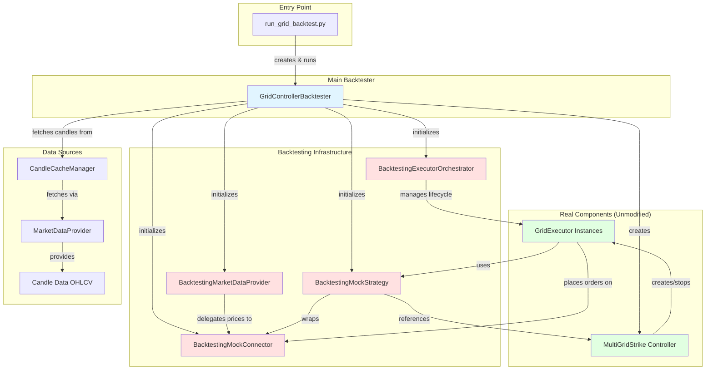
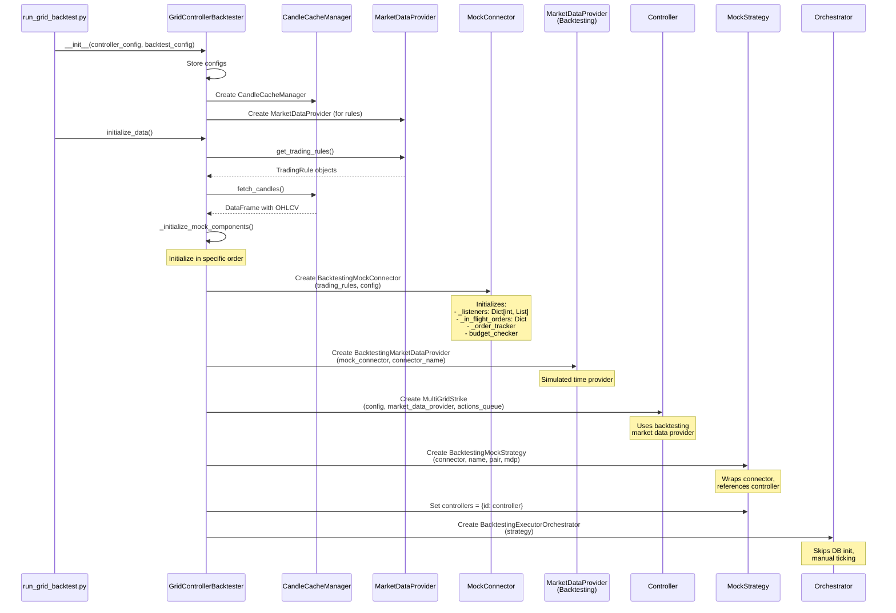
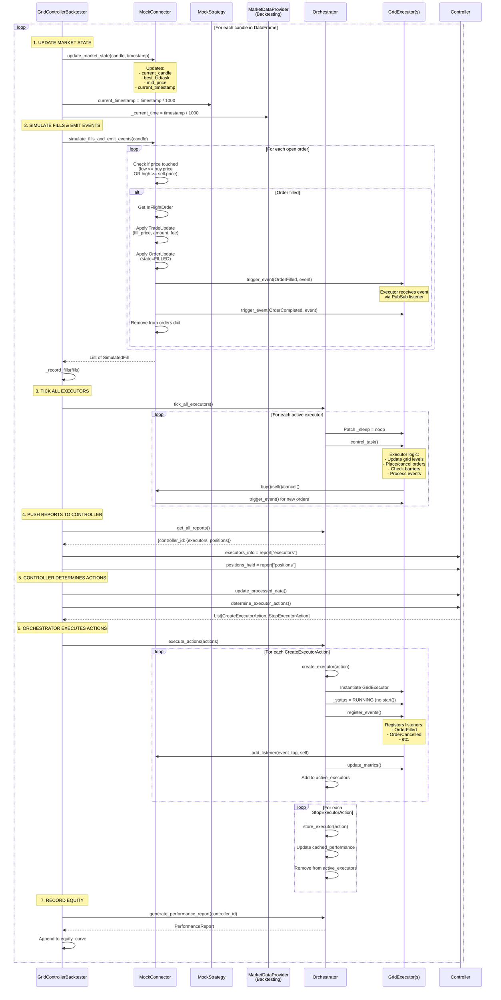
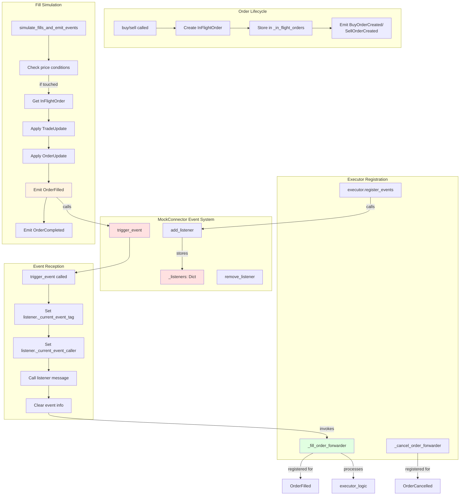
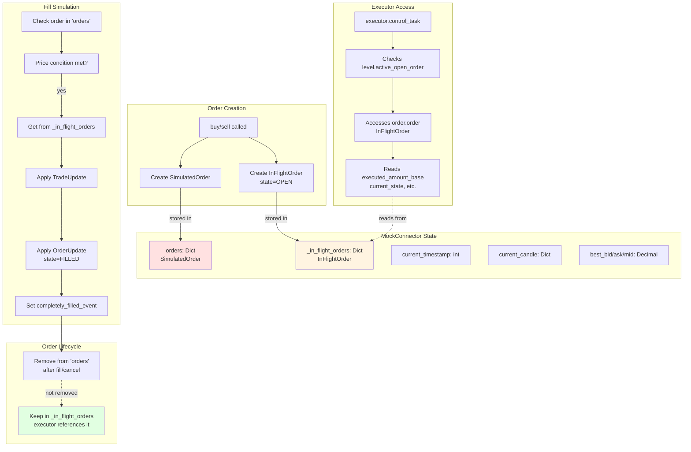
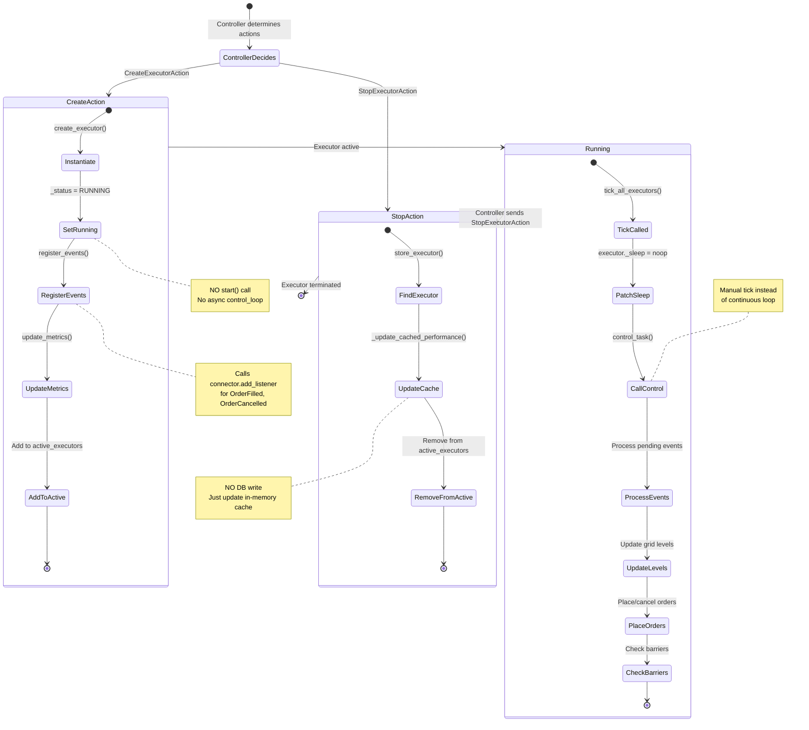
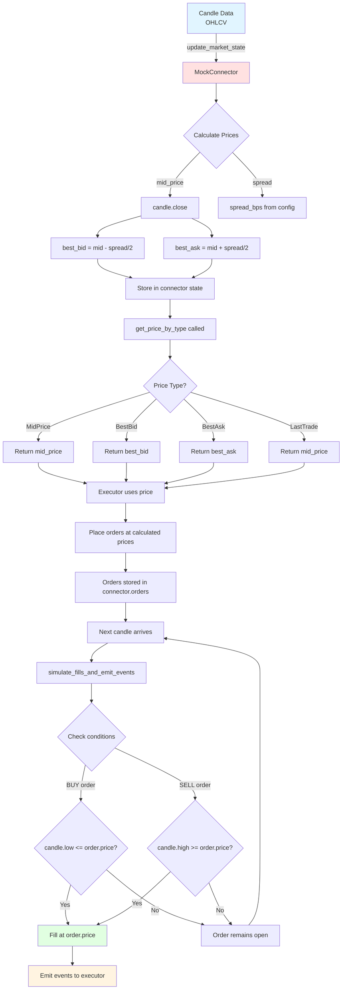
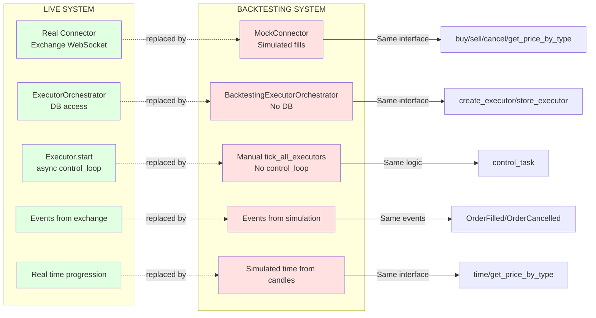

# Grid Backtester Architecture

## High-Level Architecture



## Component Initialization Flow



## Main Simulation Loop (Per Candle)



## Event Flow: PubSub System



## State Management: Orders and InFlightOrders



## Orchestrator Executor Lifecycle



## Market State Updates



## Key Differences: Live vs Backtesting



## Summary

### Key Design Principles

1. **Interface Compatibility**: Mock components provide the same interfaces as live components
2. **Event-Driven**: PubSub system mimics real exchange events
3. **Manual Control**: Replace async loops with manual ticking for deterministic simulation
4. **State Isolation**: InFlightOrders tracked separately from active orders for executor reference
5. **No Modifications**: Controller and Executor code remain completely unchanged

### Data Flow

```
Candle Data → MockConnector (state update) → Executors (via events) →
Orders placed → Fill simulation → Events fired → Executors update →
Controller decides → Orchestrator manages → Repeat
```

### Critical Components

1. **MockConnector**: Exchange simulation + event emission
2. **BacktestingMarketDataProvider**: Simulated time management
3. **BacktestingExecutorOrchestrator**: Manual executor lifecycle (no DB/async)
4. **InFlightOrder tracking**: Dual tracking for active orders vs executor references
5. **PubSub emulation**: trigger_event sets listener state before calling
